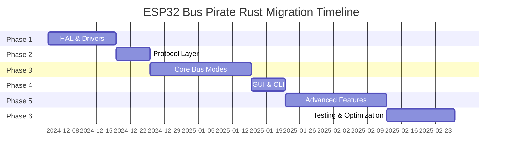

# Rust Migration Overview

This section documents the comprehensive migration of the ESP32 Bus Pirate firmware from C/ESP-IDF (Arduino framework) to Rust with `no_std`.

## Why Rust?

### Memory Safety

Rust provides memory safety guarantees at compile time without garbage collection:

- **No null pointer dereferences**
- **No buffer overflows**
- **No use-after-free bugs**
- **No data races**

### Zero-Cost Abstractions

Rust's abstractions compile down to the same machine code as hand-written C:

```rust
// High-level Rust
for item in collection.iter() {
    process(item);
}

// Compiles to the same as:
// for (int i = 0; i < len; i++) {
//     process(collection[i]);
// }
```

### Modern Language Features

- **Pattern matching**: Exhaustive, compile-time checked
- **Traits**: Zero-cost polymorphism
- **Type inference**: Less boilerplate
- **Cargo**: Excellent package manager
- **async/await**: First-class async support (if needed)

### Embedded-First

The Rust embedded ecosystem (`no_std`) is mature and well-designed:

- `embedded-hal`: Hardware abstraction traits
- `embedded-graphics`: 2D graphics for displays
- `heapless`: Data structures without heap allocation
- `defmt`: Efficient logging
- Active community and excellent documentation

## Migration Strategy

### Phased Approach

The migration is divided into 6 phases over 12 weeks:



### Component Mapping

| C/ESP-IDF Component | Rust Equivalent |
|---------------------|-----------------|
| Arduino framework | `esp-hal` |
| TFT_eSPI | `st7789` + `embedded-graphics` |
| ArduinoJson | `postcard` (binary) |
| FastLED | `smart-leds` |
| Wire (I²C) | `embedded-hal::i2c` |
| SPI | `embedded-hal::spi` |
| Serial | `embedded-hal::serial` |

## Documentation

- [Design Document](./design.md) - Complete architecture and design
- [Protocol Specification](./protocol.md) - Binary protocol details
- [Implementation Tasks](./tasks.md) - Detailed task breakdown

## Current Status

### Completed ✅

- [x] Project structure and workspace setup
- [x] HAL crate with board initialization
- [x] Protocol crate with message definitions
- [x] Basic bus mode implementations (stubs)
- [x] Comprehensive documentation

### In Progress 🔄

- [ ] Display driver integration (Slint)
- [ ] Touch controller driver
- [ ] USB CDC serial
- [ ] I²C mode implementation

### Planned 📋

See [Implementation Tasks](./tasks.md) for the complete roadmap.

## Key Decisions

### `no_std` Environment

**Decision**: Use `no_std` Rust without ESP-IDF

**Rationale**:
- Smaller binary size
- Faster boot time
- Direct hardware control
- No runtime overhead
- Better for real-time requirements

### Slint for GUI

**Decision**: Use Slint framework for the GUI

**Rationale**:
- Designed for embedded systems
- Low memory footprint
- Excellent performance on ESP32-S3
- Declarative UI language
- Hot-reload during development

See [Slint Framework](./slint.md) for details.

### Postcard for Serialization

**Decision**: Use `postcard` instead of Protocol Buffers

**Rationale**:
- Minimal overhead (1-2 bytes)
- Excellent `no_std` support
- Very fast encoding/decoding
- Simpler than protobuf
- Sufficient for our needs

### Static Allocation

**Decision**: Prefer static allocation with `heapless` over dynamic heap

**Rationale**:
- Avoid fragmentation
- Predictable memory usage
- No allocation failures
- Better for embedded systems

## Contributing to the Migration

### Getting Started

1. **Read the design docs**: [Design Document](./design.md)
2. **Set up Rust toolchain**: [Building from Source](../../getting-started/building.md)
3. **Pick a task**: [Implementation Tasks](./tasks.md)
4. **Follow conventions**: [Contributing Guide](./contributing.md)

### Areas Needing Help

- **HAL & Drivers**: Low-level hardware interfaces
- **Protocol Implementation**: Binary protocol handling
- **Bus Modes**: I²C, SPI, UART, etc. implementations
- **GUI Development**: Slint UI screens
- **Testing**: Unit and integration tests
- **Documentation**: User guides and tutorials

## Resources

### Rust Embedded

- [The Embedded Rust Book](https://docs.rust-embedded.org/book/)
- [esp-rs Organization](https://github.com/esp-rs)
- [esp-hal Documentation](https://docs.rs/esp-hal/)
- [Awesome Embedded Rust](https://github.com/rust-embedded/awesome-embedded-rust)

### ESP32-S3

- [ESP32-S3 Technical Reference](https://www.espressif.com/sites/default/files/documentation/esp32-s3_technical_reference_manual_en.pdf)
- [ESP32-S3 Datasheet](https://www.espressif.com/sites/default/files/documentation/esp32-s3_datasheet_en.pdf)

### Tools

- [cargo-espflash](https://github.com/esp-rs/espflash) - Flash ESP32 from Rust
- [espup](https://github.com/esp-rs/espup) - Install Xtensa toolchain
- [probe-rs](https://probe.rs/) - Debugging (future)

## Timeline

**Start Date**: December 5, 2024
**Target Completion**: February 28, 2025 (12 weeks)

**Milestones**:

- **Week 2**: HAL and display working
- **Week 3**: Protocol over USB
- **Week 6**: Core bus modes functional
- **Week 7**: GUI complete
- **Week 10**: Feature parity with C version
- **Week 12**: Testing complete, ready for release

## Success Criteria

The migration will be considered successful when:

1. ✅ All 20+ bus modes are functional
2. ✅ Touch GUI is working smoothly
3. ✅ Binary size < 1MB
4. ✅ Boot time < 3 seconds
5. ✅ No memory leaks or crashes
6. ✅ Performance matches or exceeds C version
7. ✅ Comprehensive documentation
8. ✅ Test coverage > 70%

## See Also

- [Architecture Overview](./architecture.md)
- [Build System](./build.md)
- [Testing Strategy](./testing.md)
