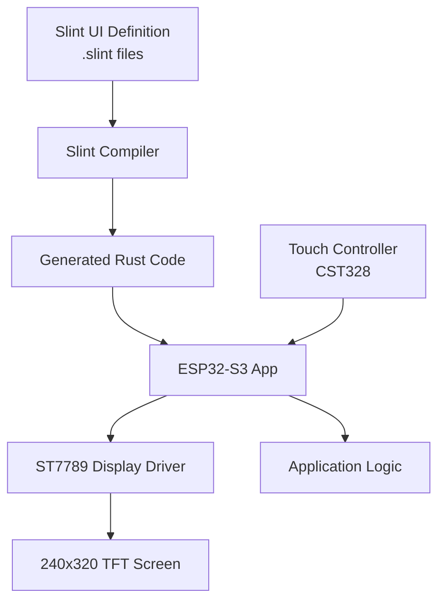

# Slint Framework for GUI

## Overview

The ESP32 Bus Pirate uses [Slint](https://slint.dev/) for its graphical user interface. Slint is a modern, lightweight GUI toolkit specifically designed for embedded systems and resource-constrained devices.

## Why Slint?

### Perfect for ESP32-S3

1. **Low Memory Footprint**
   - Minimal RAM usage (< 100KB for typical UIs)
   - No heap fragmentation
   - Static memory allocation

2. **High Performance**
   - Native rendering without GPU
   - Smooth 60 FPS on ESP32-S3
   - Touch-optimized interactions

3. **Embedded-First Design**
   - `no_std` compatible
   - Works with `embedded-graphics`
   - Direct framebuffer rendering

4. **Developer Experience**
   - Declarative UI language (.slint files)
   - Hot reload during development
   - Type-safe Rust API

## Architecture



## Example UI Structure

### Main Menu (.slint)

```slint
import { Button, VerticalBox } from "std-widgets.slint";

export component MainMenu inherits Window {
    width: 240px;
    height: 320px;
    
    VerticalBox {
        padding: 10px;
        spacing: 15px;
        
        Text {
            text: "ESP32 Bus Pirate";
            font-size: 24px;
            horizontal-alignment: center;
        }
        
        Button {
            text: "I²C Mode";
            clicked => { root.mode-selected(1); }
        }
        
        Button {
            text: "SPI Mode";
            clicked => { root.mode-selected(2); }
        }
        
        Button {
            text: "UART Mode";
            clicked => { root.mode-selected(3); }
        }
        
        Button {
            text: "Settings";
            clicked => { root.settings-clicked(); }
        }
    }
    
    callback mode-selected(int);
    callback settings-clicked();
}
```

### Rust Integration

```rust
slint::include_modules!();

fn main() {
    let ui = MainMenu::new().unwrap();
    
    ui.on_mode_selected(|mode| {
        match mode {
            1 => println!("I2C Mode selected"),
            2 => println!("SPI Mode selected"),
            3 => println!("UART Mode selected"),
            _ => {}
        }
    });
    
    ui.on_settings_clicked(|| {
        println!("Settings clicked");
    });
    
    ui.run().unwrap();
}
```

## Features in ESP32 Bus Pirate

### Implemented Screens

1. **Main Menu**
   - Mode selection
   - Status display
   - Battery indicator
   - Settings access

2. **Bus Mode Screen**
   - Protocol configuration
   - Pin assignment
   - Real-time data view
   - Action buttons

3. **Logic Analyzer View**
   - Waveform display
   - Timing markers
   - Zoom/pan controls
   - Export options

4. **Settings**
   - Display brightness
   - Power management
   - Network configuration
   - About/Info

### Touch Interactions

Slint provides natural touch support:

- **Tap**: Select buttons, menu items
- **Long Press**: Context menus
- **Swipe**: Navigate between screens
- **Pinch**: Zoom logic analyzer traces (future)

## Performance Optimization

### Memory Management

```rust
// Pre-allocate UI buffers in PSRAM
#[link_section = ".psram.bss"]
static mut UI_BUFFER: [u8; 240 * 320 * 2] = [0; 240 * 320 * 2];

// Use static allocation for Slint
slint::platform::set_platform(Box::new(
    EmbeddedPlatform::new(&mut UI_BUFFER)
)).unwrap();
```

### Rendering Strategy

1. **Double Buffering**: Eliminates tearing
2. **Partial Updates**: Only redraw changed regions
3. **DMA Transfers**: Offload display updates to hardware

## Development Workflow

### 1. Design UI in Slint

```bash
# Create/edit .slint files
vim ui/main_menu.slint
```

### 2. Live Preview (Desktop)

```bash
# Run on desktop for rapid iteration
cargo run --bin ui-preview
```

### 3. Test on Device

```bash
# Flash to ESP32-S3
cargo run --release
```

### 4. Performance Profiling

```rust
use esp_println::println;

let start = esp_hal::time::now();
ui.update();
let elapsed = esp_hal::time::now() - start;
println!("UI update took: {} µs", elapsed.as_micros());
```

## Styling and Themes

### Custom Theme

```slint
export global Theme {
    // Colors
    out property <color> background: #1a1a1a;
    out property <color> foreground: #ffffff;
    out property <color> primary: #00aaff;
    out property <color> success: #00ff00;
    out property <color> warning: #ffaa00;
    out property <color> error: #ff0000;
    
    // Sizes
    out property <length> button-height: 40px;
    out property <length> padding: 10px;
    out property <length> border-radius: 5px;
}
```

### Dark Mode Support

```slint
if is-dark-mode: true {
    background: Theme.background;
} else {
    background: #f0f0f0;
}
```

## Accessibility

Slint supports:
- Large touch targets (40px minimum)
- High contrast themes
- Font scaling
- Screen reader hints (future)

## Resources

- **Official Docs**: [slint.dev/docs](https://slint.dev/docs)
- **Examples**: [github.com/slint-ui/slint/tree/master/examples](https://github.com/slint-ui/slint/tree/master/examples)
- **ESP32 Guide**: [slint.dev/esp32](https://slint.dev/blog/esp32)
- **Community**: [Discord](https://slint.dev/chat)

## Migration Path

The C++ version uses TFT_eSPI and custom drawing. Migration to Slint involves:

1. **Phase 1**: Convert main menu to Slint ✅
2. **Phase 2**: Bus mode screens
3. **Phase 3**: Logic analyzer view
4. **Phase 4**: Settings and dialogs
5. **Phase 5**: Polish and optimize

See [GUI Development](./gui.md) for implementation details.
