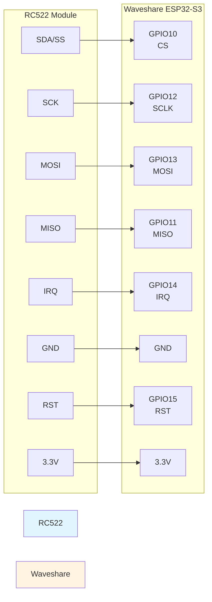
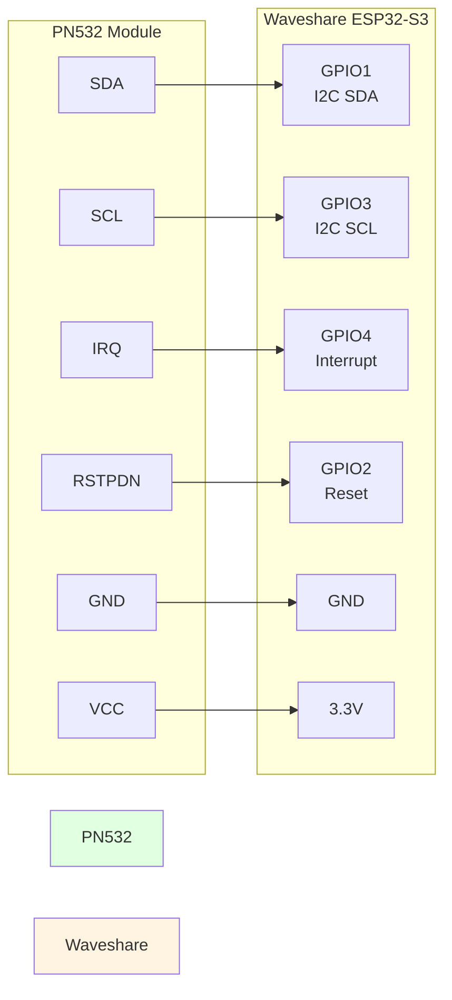
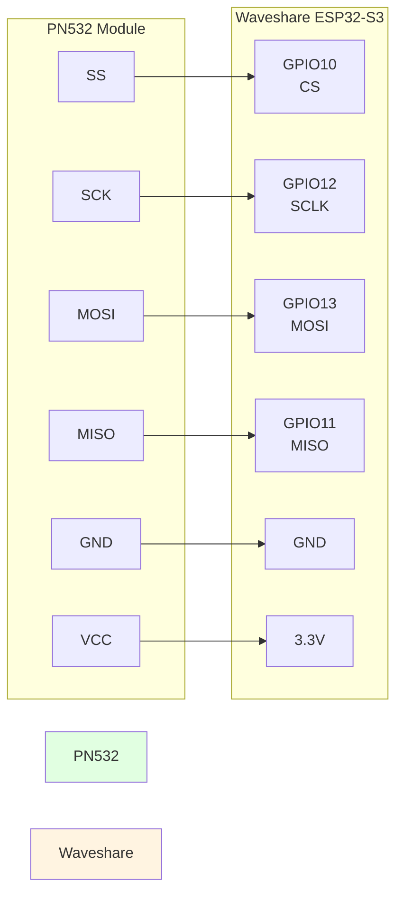

# RFID Readers - Hardware & Wiring

## Overview

The ESP32 Bus Pirate supports multiple RFID reader modules for reading and writing 13.56MHz RFID/NFC tags (ISO14443A/B, ISO15693, MIFARE, etc.).

## Recommended Hardware

### RC522 Module

**Best for**: General-purpose RFID applications, MIFARE Classic tags

- **Protocol**: SPI
- **Frequency**: 13.56 MHz
- **Read Range**: 3-5 cm
- **Price**: ~$2-5 USD
- **Availability**: Widely available on AliExpress, Amazon

**Purchase Links**:
- [AliExpress - RC522](https://www.aliexpress.com/item/32523771442.html)
- [Amazon - RC522 Kit](https://www.amazon.com/s?k=rc522+rfid)

**Specifications**:
- Operating Voltage: 3.3V
- Operating Current: 13-26mA
- Idle Current: 10-13mA
- Max Data Rate: 10Mbit/s
- Supported Tags: MIFARE Classic, MIFARE Ultralight, NTAG213/215/216

---

### PN532 Module

**Best for**: Advanced NFC applications, mobile payment emulation

- **Protocol**: SPI, I²C, or UART (selectable)
- **Frequency**: 13.56 MHz
- **Read Range**: 5-7 cm
- **Price**: ~$8-15 USD

**Purchase Links**:
- [Adafruit PN532](https://www.adafruit.com/product/364)
- [AliExpress - PN532](https://www.aliexpress.com/item/32523801354.html)

**Specifications**:
- Operating Voltage: 3.3V or 5V (depending on module)
- Supports: ISO14443A/B, FeliCa, Peer-to-Peer (P2P), Card Emulation
- Built-in antenna or external antenna option

---

### RDM6300 Module

**Best for**: 125kHz tags (EM4100, EM4200), long-range reading

- **Protocol**: UART
- **Frequency**: 125 kHz
- **Read Range**: 5-8 cm
- **Price**: ~$3-6 USD

**Purchase Links**:
- [AliExpress - RDM6300](https://www.aliexpress.com/item/32818800017.html)

**Specifications**:
- Operating Voltage: 5V (use level shifter with ESP32)
- UART baud rate: 9600
- Read-only module
- Supports: EM4100, EM4200, and compatible 125kHz tags

## Wiring Diagrams

### RC522 to ESP32-S3



**Connection Table - RC522**:

| RC522 Pin | ESP32-S3 Pin | Signal |
|-----------|--------------|--------|
| SDA (SS)  | GPIO10       | Chip Select |
| SCK       | GPIO12       | SPI Clock |
| MOSI      | GPIO13       | Master Out Slave In |
| MISO      | GPIO11       | Master In Slave Out |
| IRQ       | GPIO14       | Interrupt (optional) |
| GND       | GND          | Ground |
| RST       | GPIO15       | Reset |
| 3.3V      | 3.3V         | Power |

---

### PN532 to ESP32-S3 (I²C Mode)



**Connection Table - PN532 (I²C)**:

| PN532 Pin | ESP32-S3 Pin | Signal |
|-----------|--------------|--------|
| SDA       | GPIO1        | I²C Data |
| SCL       | GPIO3        | I²C Clock |
| IRQ       | GPIO4        | Interrupt (optional) |
| RSTPDN    | GPIO2        | Reset |
| GND       | GND          | Ground |
| VCC       | 3.3V         | Power |

> **Note**: Set PN532 to I²C mode by setting DIP switches: OFF, ON

---

### PN532 to ESP32-S3 (SPI Mode)



**Connection Table - PN532 (SPI)**:

| PN532 Pin | ESP32-S3 Pin | Signal |
|-----------|--------------|--------|
| SS        | GPIO10       | Chip Select |
| SCK       | GPIO12       | SPI Clock |
| MOSI      | GPIO13       | Master Out Slave In |
| MISO      | GPIO11       | Master In Slave Out |
| GND       | GND          | Ground |
| VCC       | 3.3V         | Power |

> **Note**: Set PN532 to SPI mode by setting DIP switches: ON, OFF

## Usage

### Firmware Configuration

1. **Enter RFID Mode**:
   ```
   > mode rfid
   RFID mode selected
   ```

2. **Configure Reader Type**:
   ```
   > rfid config rc522
   RC522 configured on SPI
   ```

3. **Scan for Tags**:
   ```
   > rfid scan
   Scanning for tags...
   Tag found: UID = 04:52:C2:1A:23:64:80
   Type: MIFARE Classic 1K
   ```

### Reading Data

```
> rfid read 0x04
Block 4: 00 00 00 00 00 00 00 00 00 00 00 00 00 00 00 00
```

### Writing Data

```
> rfid write 0x04 "Hello RFID!"
Writing to block 4...
Write successful
```

## Safety Considerations

### Power Requirements

- **Always use 3.3V** for RC522 and most PN532 modules
- Check your specific module's voltage requirements
- Use level shifters if mixing 5V and 3.3V logic

### Connection Tips

1. **Keep wires short** (< 10cm) for SPI connections
2. **Use decoupling capacitors** (100nF near VCC/GND)
3. **Avoid interference** from display or other high-frequency devices
4. **Test continuity** before powering on

### Common Issues

| Problem | Solution |
|---------|----------|
| No tag detected | Check antenna connection, try moving tag closer |
| Read errors | Verify SPI/I²C wiring, check clock speed |
| Module not responding | Check reset pin, verify power voltage |
| Intermittent operation | Add 10µF capacitor near module VCC |

## Advanced Features

### Simultaneous Multi-Reader

The ESP32-S3 can control multiple RFID readers on different CS pins:

```rust
let reader1 = RC522::new(spi1, cs_pin1);
let reader2 = RC522::new(spi2, cs_pin2);

// Scan both readers
let tag1 = reader1.scan();
let tag2 = reader2.scan();
```

### Mobile Integration

Save scanned tags to SD card, then access via mobile app:

```json
{
  "timestamp": "2024-12-05T10:30:00Z",
  "uid": "04:52:C2:1A:23:64:80",
  "type": "MIFARE_CLASSIC_1K",
  "data": "..."
}
```

## See Also

- [RFID Mode Documentation](../modes/rfid.md)
- [SPI Configuration](../modes/spi.md)
- [I²C Configuration](../modes/i2c.md)
- [Data Logging](../user-guide/data-logging.md)
