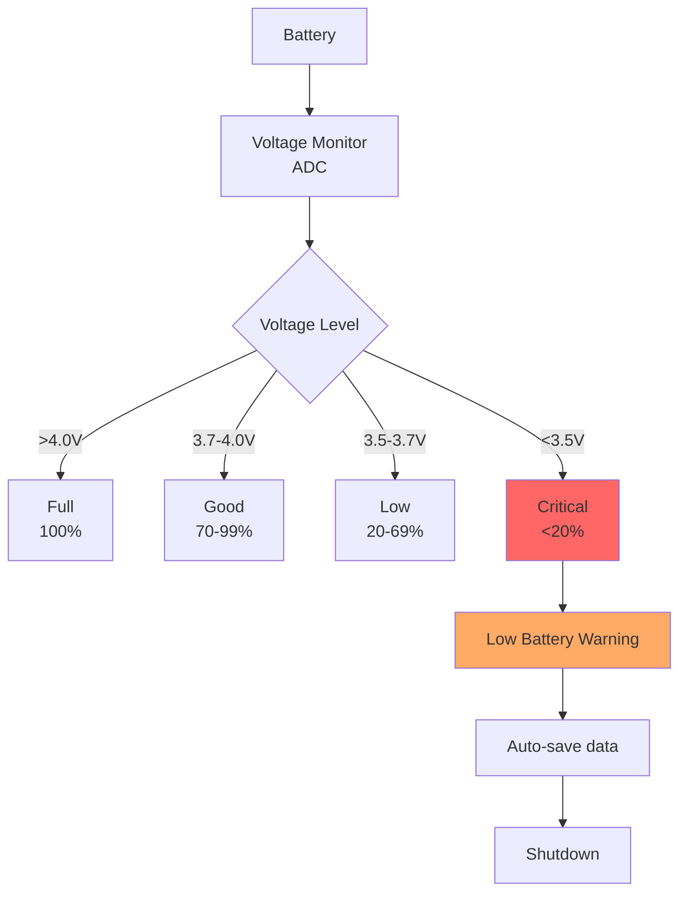
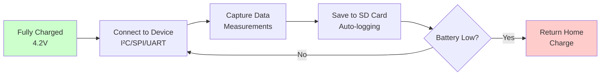

# Battery Operation

## Overview

The Waveshare ESP32-S3-Touch-LCD-2.8 board features a built-in JST connector for LiPo battery operation, making the ESP32 Bus Pirate truly portable for field use.

## Battery Specifications

### Recommended Batteries

| Capacity | Runtime | Use Case |
|----------|---------|----------|
| 500mAh | ~2-3 hours | Light use, testing |
| 1000mAh | ~4-6 hours | General use |
| 2000mAh | ~8-12 hours | Extended fieldwork |
| 3000mAh+ | ~12-18 hours | All-day operation |

**Form Factor**: 103450 (recommended), or any 3.7V LiPo with JST-PH 2.0mm connector

### Purchase Links

- [Adafruit 1200mAh LiPo](https://www.adafruit.com/product/258)
- [Amazon - 103450 LiPo batteries](https://www.amazon.com/s?k=103450+lipo+battery)
- [AliExpress - Various capacities](https://www.aliexpress.com/wholesale?SearchText=103450+battery)

## Power Consumption

### Typical Current Draw

| Mode | Display On | Display Off | Notes |
|------|------------|-------------|-------|
| Idle | 120mA | 80mA | Just powered on |
| I²C/SPI | 150mA | 110mA | Active bus operations |
| Wi-Fi Active | 250mA | 200mA | Sending/receiving data |
| Bluetooth | 180mA | 140mA | BLE advertising |
| Display Max | 180mA | - | Full brightness, complex UI |
| Deep Sleep | 0.5mA | 0.5mA | Wake on touch/button |

### Battery Life Calculation

```
Runtime (hours) = Battery Capacity (mAh) / Average Current (mA)

Example: 1000mAh / 150mA = 6.67 hours
```

## Power Management Features

### Auto-Sleep

The device automatically enters low-power mode after inactivity:

- **Screen Off**: After 1 minute (configurable)
- **Deep Sleep**: After 5 minutes (configurable)
- **Wake Methods**: Touch screen, press button, incoming data

### Battery Monitoring



### Voltage to Percentage Mapping

| Voltage | Percentage | Status |
|---------|------------|--------|
| 4.2V | 100% | Fully charged |
| 4.0V | 90% | Excellent |
| 3.9V | 80% | Good |
| 3.8V | 60% | Fair |
| 3.7V | 40% | Low |
| 3.6V | 20% | Very Low |
| 3.5V | 10% | Critical |
| <3.4V | 0% | Shutdown |

## Charging

### Built-in Charging Circuit

The board includes an onboard charging IC (typically TP4056):

- **Input**: USB-C 5V
- **Charge Current**: ~500mA (default)
- **Charge Time**: Capacity (mAh) / 500mA
  - 1000mAh battery: ~2 hours
  - 2000mAh battery: ~4 hours

### Charging Indicators

- **Red LED**: Charging in progress
- **Green LED**: Charging complete
- **No LED**: No battery or error

### Charge While Operating

✅ **YES** - You can use the device while charging
- Device automatically switches between USB and battery power
- Charging may be slower during operation

## Safety Features

### Over-Discharge Protection

The firmware monitors battery voltage and:

1. **Warning at 20%**: Display warning message
2. **Auto-save at 10%**: Save all data to SD card
3. **Shutdown at 5%**: Graceful shutdown to prevent damage

### Over-Temperature Protection

- Monitor internal temperature sensor
- Throttle CPU if temperature > 70°C
- Shutdown if temperature > 85°C

### Brownout Detection

ESP32-S3 built-in brownout detector prevents operation below:
- **2.43V** (default threshold)
- Automatically resets when power restores

## Power Optimization Tips

### Extend Battery Life

1. **Reduce Display Brightness**
   ```
   Settings > Display > Brightness: 50%
   ```

2. **Enable Auto-Sleep**
   ```
   Settings > Power > Sleep after: 1 minute
   ```

3. **Disable Unused Radios**
   ```
   Settings > Wi-Fi: Off (when not needed)
   Settings > Bluetooth: Off (when not needed)
   ```

4. **Use Deep Sleep**
   - Wake only when needed
   - Save state before sleeping

### Firmware Configuration

```rust
// Example power settings
const DISPLAY_TIMEOUT_MS: u32 = 60_000; // 1 minute
const DEEP_SLEEP_TIMEOUT_MS: u32 = 300_000; // 5 minutes
const LOW_BATTERY_THRESHOLD_MV: u32 = 3_600; // 3.6V
```

## Battery Care

### Storage

- **Long-term storage**: Charge to 50-60%
- **Temperature**: Store at room temperature (15-25°C)
- **Check every 3 months**: Recharge if voltage drops below 3.7V

### Lifespan

- **Typical**: 300-500 charge cycles
- **Signs of aging**: Reduced capacity, swelling
- **Replace if**: Capacity < 70% of original or physical damage

### Safe Disposal

⚠️ **Do not throw LiPo batteries in regular trash!**

- Find a battery recycling center
- Many electronics stores accept old batteries
- Check local regulations

## Mobile Operation Workflow

### Typical Field Session



### Data Logging Strategy

1. **Enable auto-save**:
   ```
   Settings > Data Logging > Auto-save: On
   Settings > Data Logging > Interval: 10 seconds
   ```

2. **Monitor battery**:
   - Check icon in status bar
   - Set low-battery alert

3. **Transfer data**:
   - Use mobile app (Wi-Fi)
   - Remove SD card and transfer via computer
   - USB cable connection

## Troubleshooting

### Battery Not Charging

1. Check USB-C cable (data cables work best)
2. Verify battery connection (JST connector)
3. Try different power adapter (5V 1A minimum)
4. Check charging LED indicators

### Short Battery Life

1. Verify actual battery capacity (not labeled capacity)
2. Check for runaway processes
3. Reduce display brightness
4. Disable unused features

### Device Won't Power On

1. Charge for at least 30 minutes
2. Check battery voltage with multimeter (should be >3.0V)
3. Try with USB power only (no battery)
4. Battery may be completely discharged (recovery may not be possible)

## Future Enhancements

### Planned Features

- [ ] Battery health monitoring
- [ ] Charge cycle counting
- [ ] Historical power usage graphs
- [ ] Predictive battery life estimates
- [ ] Power profile customization

## See Also

- [Power Management Settings](../user-guide/overview.md)
- [Data Logging](../user-guide/data-logging.md)
- [Hardware Specifications](../reference/hardware-specs.md)
