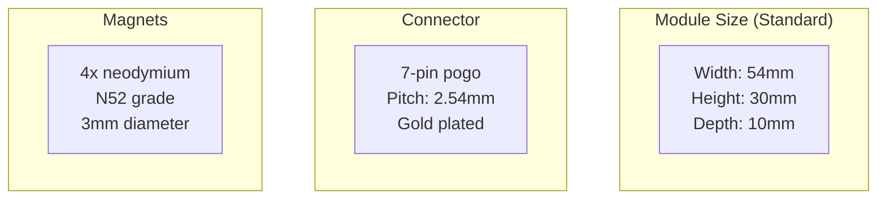

# Modular Hardware Connectors (Future)

## Overview

The ESP32 Bus Pirate is designed with future expansion in mind. Following the successful M5Stack modular ecosystem, we plan to add support for magnetic pogo pin connectors for easy, hot-swappable hardware modules.

## Design Goals

### User Experience

- **Tool-free**: No screws or soldering required
- **Hot-swappable**: Connect/disconnect while powered
- **Robust**: Strong magnetic hold, reliable electrical connection
- **Reversible**: Works in any orientation (with keying)

### Technical Requirements

- **Current capacity**: 1A per pin minimum
- **Pin count**: 6-8 pins (power, I²C, SPI, GPIO)
- **Connector pitch**: 2.54mm or 3mm
- **Alignment**: Self-aligning with magnets

## Connector Specification

### Pin Assignment (Proposed)

```
┌─────────────────────────────┐
│  1   2   3   4   5   6   7  │
│ GND 3V3 SDA SCL CLK DAT CS  │
└─────────────────────────────┘
```

| Pin | Signal | Description |
|-----|--------|-------------|
| 1 | GND | Ground |
| 2 | 3.3V | Power (1A max) |
| 3 | SDA | I²C Data |
| 4 | SCL | I²C Clock |
| 5 | CLK | SPI Clock |
| 6 | DAT | SPI MOSI/MISO (bidirectional) |
| 7 | CS | Chip Select / GPIO |

### Physical Dimensions



## Module Ecosystem

### Standard Modules (Planned)

#### RF Modules

**RFID/NFC Module**
- RC522 or PN532
- Built-in antenna
- Auto-detection
- Estimated cost: $10-15

**Sub-GHz Module**
- CC1101 transceiver
- 315/433/868/915 MHz
- Programmable antenna
- Estimated cost: $12-18

**NRF24 Module**
- nRF24L01+ radio
- 2.4GHz ISM band
- Enhanced ShockBurst
- Estimated cost: $8-12

#### Interface Modules

**CAN Bus Module**
- MCP2515 + TJA1050
- Screw terminals
- LED indicators
- Estimated cost: $8-10

**Ethernet Module**
- W5500 chip
- RJ45 connector
- PoE option
- Estimated cost: $15-20

**USB Host Module**
- MAX3421E
- Type-A connector
- USB HID support
- Estimated cost: $10-15

#### Expansion Modules

**GPIO Expander**
- 8 additional GPIOs
- LED indicators
- Screw terminals
- Estimated cost: $6-8

**Sensor Module**
- Environmental sensors
- BME280 (temp/humidity/pressure)
- Light sensor
- Estimated cost: $10-12

**Prototyping Module**
- Blank PCB
- Breakout pins
- DIY friendly
- Estimated cost: $5-7

## Hardware Design

### Base Unit Modifications

The main ESP32-S3 device will need:

1. **Connector PCB**
   - 7-pin pogo pin socket
   - 4 magnet holes
   - Mounting holes

2. **Module Detection**
   - I²C address scanning
   - Module identification EEPROM
   - Auto-configuration

3. **Power Management**
   - Current limiting (1A per module)
   - Over-voltage protection
   - Hot-plug detection

### Module PCB Template

Standard module PCB layout:

```
┌─────────────────────────────────┐
│  ╔═══════════════════════════╗  │
│  ║                           ║  │
│  ║    Component Area         ║  │
│  ║    (Your Circuit Here)    ║  │
│  ║                           ║  │
│  ╚═══════════════════════════╝  │
│                                 │
│  ○  ●●●●●●●  ○                  │
│  M  Pogo Pins M                 │
│  ○           ○                  │
└─────────────────────────────────┘

M = Magnet
● = Pogo pin pad
```

## Firmware Support

### Auto-Detection

```rust
pub enum ModuleType {
    RfidRc522,
    RfidPn532,
    SubGhzCc1101,
    Nrf24Radio,
    CanBus,
    Ethernet,
    UsbHost,
    GpioExpander,
    Sensor,
    Unknown,
}

pub struct Module {
    module_type: ModuleType,
    i2c_address: Option<u8>,
    version: u8,
    capabilities: u32,
}

impl Module {
    pub fn detect() -> Result<Self, Error> {
        // Scan I2C bus for module EEPROM
        // Read module ID and capabilities
        // Initialize module-specific driver
    }
}
```

### Module Manager

```rust
pub struct ModuleManager {
    modules: heapless::Vec<Module, 4>,
    hot_plug_callback: Option<fn(ModuleType)>,
}

impl ModuleManager {
    pub fn scan(&mut self) {
        // Detect all connected modules
        // Initialize drivers
        // Register with bus mode system
    }
    
    pub fn on_hot_plug(&mut self, callback: fn(ModuleType)) {
        self.hot_plug_callback = Some(callback);
    }
}
```

### Configuration Storage

Each module has an onboard EEPROM (e.g., AT24C02) storing:

```rust
struct ModuleConfig {
    magic: u32,           // 0x4D4F4455 "MODU"
    version: u8,          // Config version
    module_type: u8,      // ModuleType enum
    vendor_id: u16,       // Vendor identifier
    product_id: u16,      // Product identifier
    serial: [u8; 16],     // Unique serial number
    name: [u8; 32],       // Human-readable name
    capabilities: u32,    // Capability flags
    gpio_map: [u8; 8],    // GPIO mapping
    checksum: u16,        // CRC-16
}
```

## Development Kit

### Module Starter Kit

For developers wanting to create custom modules:

**Included:**
- 2x Blank PCBs with connectors
- 8x Neodymium magnets
- 7x Pogo pins
- AT24C02 EEPROM (pre-programmed as "Custom")
- Example schematic and PCB layout
- Firmware examples

**Price**: ~$20

### Design Files

All design files will be open-source:

- **KiCad PCB layouts**: Module template and reference designs
- **3D Models**: For enclosure design
- **Firmware library**: Module driver API
- **Documentation**: Design guidelines

## Timeline

### Phase 1: Prototype (Q2 2025)

- [ ] Design connector PCB for base unit
- [ ] Create reference module (RFID)
- [ ] Test mechanical fit and electrical connection
- [ ] Validate hot-plug detection

### Phase 2: Firmware Support (Q3 2025)

- [ ] Implement module detection
- [ ] Create module driver framework
- [ ] Add GUI support for modules
- [ ] Test with multiple modules

### Phase 3: Production (Q4 2025)

- [ ] Finalize PCB design
- [ ] Source components
- [ ] Create assembly documentation
- [ ] Release open-source designs

## Community Modules

We encourage the community to design custom modules:

- **Submit designs**: Pull requests to the modules repository
- **Share on forum**: Showcase your creations
- **Collaborate**: Work with others on complex modules

**Popular ideas from community:**
- Logic analyzer module
- GPS module
- LoRa radio module
- Motor controller
- Audio codec

## Comparison with M5Stack

| Feature | M5Stack | ESP32 Bus Pirate |
|---------|---------|------------------|
| Connector | Proprietary | Standard pogo pins |
| Pin count | 16 | 7 |
| Alignment | Magnets + grooves | Magnets only |
| Power | Up to 5V/1A | 3.3V/1A |
| Stacking | Yes | No (side-mount) |
| Open Design | Partially | Fully open-source |

## Safety Considerations

### Electrical

- **Reverse polarity protection**: Diode on power pins
- **Over-current protection**: Resettable fuse (1A)
- **ESD protection**: TVS diodes on signal pins

### Mechanical

- **Keying**: Physical notch to prevent incorrect insertion
- **Retention**: 4 magnets provide strong hold
- **Durability**: Gold-plated contacts for longevity

## See Also

- [Hardware Specifications](../reference/hardware-specs.md)
- [External Hardware Guide](../external-hardware/overview.md)
- [Contributing](../development/contributing.md)
